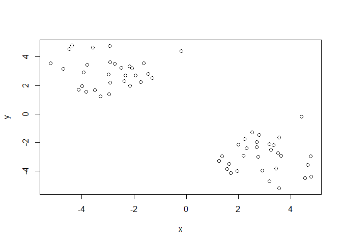
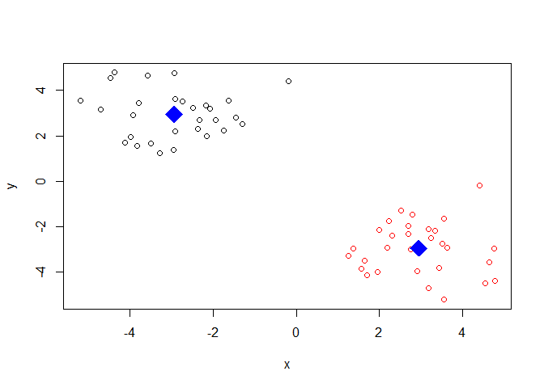
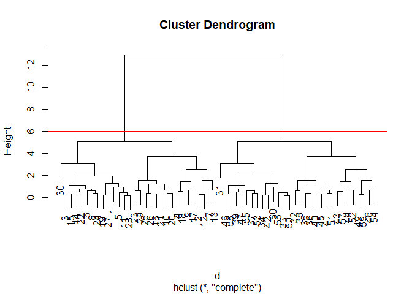
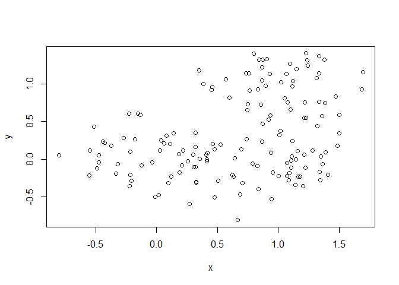
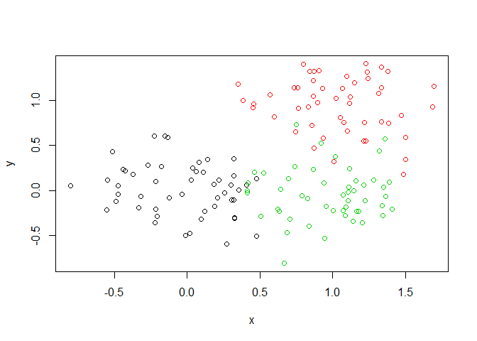
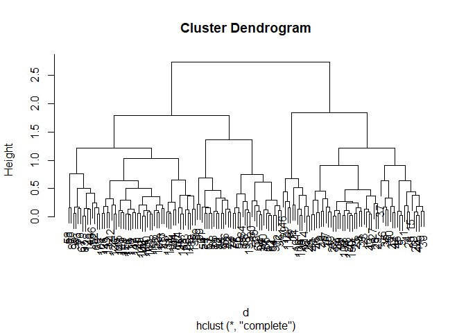
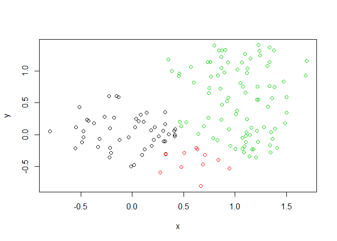

class08
================
Xiao
2019/4/25

## K-means clustering

``` r
tmp <- c(rnorm(30,-3), rnorm(30,3))
x <- cbind(x=tmp, y=rev(tmp))
plot(x)
```

<!-- -->

``` r
km <- kmeans(x, centers = 2, nstart = 20)
plot(x, col = km$cluster)
points(km$centers, pch = 18, col = "blue", cex = 3)
```

<!-- -->

``` r
vcol <- c("blue","green")
#plotcluster(x, y$cluster, pch = y$cluster, clvecd=c(1,2), col=vcol[y$cluster])
```

## Hierarchical clustering example

We must give the \*hclust()\*\* function a distance matrix not the raw
data as input

``` r
# Distance matrix calculation
d <- dist(x)
#Clustering 
hc <- hclust(d)
plot(hc)
abline(h=6, col="red")
```

<!-- -->

``` r
cutree(hc, h = 6) 
```

    ##  [1] 1 1 1 1 1 1 1 1 1 1 1 1 1 1 1 1 1 1 1 1 1 1 1 1 1 1 1 1 1 1 2 2 2 2 2
    ## [36] 2 2 2 2 2 2 2 2 2 2 2 2 2 2 2 2 2 2 2 2 2 2 2 2 2

## Another Hierarchical clustering example but more real life with overlaping region

``` r
x <- rbind(
 matrix(rnorm(100, mean=0, sd = 0.3), ncol = 2), # c1
 matrix(rnorm(100, mean = 1, sd = 0.3), ncol = 2), # c2
 matrix(c(rnorm(50, mean = 1, sd = 0.3), # c3
 rnorm(50, mean = 0, sd = 0.3)), ncol = 2))
colnames(x) <- c("x", "y")

plot(x)
```

<!-- -->

``` r
col <- as.factor( rep(c("c1","c2","c3"), each=50) )
plot(x, col=col)
```

<!-- -->

``` r
d <- dist(x)
hc <- hclust(d)
plot(hc)
```

<!-- -->

``` r
gp2 <- cutree(hc, k = 2)
gp3 <- cutree(hc, k = 3)
#col <- as.factor(rep())
plot(x, col = gp3)
```

<!-- -->

``` r
table(gp2, gp3)
```

    ##    gp3
    ## gp2  1  2  3
    ##   1 48 12  0
    ##   2  0  0 90

## PCA

We will use the **prcomp()** function for PCA

``` r
mydata <- read.csv("https://tinyurl.com/expression-CSV",
 row.names=1)
head(mydata, 10) 
```

    ##         wt1 wt2  wt3  wt4 wt5 ko1 ko2 ko3 ko4 ko5
    ## gene1   439 458  408  429 420  90  88  86  90  93
    ## gene2   219 200  204  210 187 427 423 434 433 426
    ## gene3  1006 989 1030 1017 973 252 237 238 226 210
    ## gene4   783 792  829  856 760 849 856 835 885 894
    ## gene5   181 249  204  244 225 277 305 272 270 279
    ## gene6   460 502  491  491 493 612 594 577 618 638
    ## gene7    27  30   37   29  34 304 304 285 311 285
    ## gene8   175 182  184  166 180 255 291 305 271 269
    ## gene9   658 669  653  633 657 628 627 603 635 620
    ## gene10  121 116  134  117 133 931 941 990 982 934

``` r
nrow(mydata) # how many genes in my data
```

    ## [1] 100

``` r
ncol(mydata) # how many cols in my data
```

    ## [1] 10

``` r
# let do PCA
pca <- prcomp(t(mydata), scale = T)
attributes(pca)
```

    ## $names
    ## [1] "sdev"     "rotation" "center"   "scale"    "x"       
    ## 
    ## $class
    ## [1] "prcomp"

``` r
plot(pca$x[, 1], pca$x[, 2], xlab = "PC1", ylab = "PC2")
```

<!-- -->

``` r
## Precent variance is often more informative to look at
pca.var <- pca$sdev^2
pca.var.per <- round(pca.var/sum(pca.var)*100, 1) 
head(pca.var.per)
```

    ## [1] 92.6  2.3  1.1  1.1  0.8  0.7

``` r
## A vector of colors for wt and ko samples
colvec <- colnames(mydata)
colvec[grep("wt", colvec)] <- "red"
colvec[grep("ko", colvec)] <- "blue"
plot(pca$x[,1], pca$x[,2], col=colvec, pch=16,
 xlab=paste0("PC1 (", pca.var.per[1], "%)"),
 ylab=paste0("PC2 (", pca.var.per[2], "%)")) 
```

<!-- -->

## UK PCA practice

``` r
# Q1
x <- read.csv("UK_foods.csv", row.names = 1)
dim(x)
```

    ## [1] 17  4

``` r
head(x)
```

    ##                England Wales Scotland N.Ireland
    ## Cheese             105   103      103        66
    ## Carcass_meat       245   227      242       267
    ## Other_meat         685   803      750       586
    ## Fish               147   160      122        93
    ## Fats_and_oils      193   235      184       209
    ## Sugars             156   175      147       139

``` r
# Q2
barplot(as.matrix(x), beside = T, col = rainbow(nrow(x)))
```

<!-- -->

``` r
# Q3
barplot(as.matrix(x), beside = F, col = rainbow(nrow(x)))
```

<!-- -->

``` r
# Q5
pairs(x, col=rainbow(10), pch=16)
```

<!-- -->

``` r
# Q6
```

## continue on previous section

``` r
pca <- prcomp(t(x))
summary(pca)
```

    ## Importance of components:
    ##                             PC1      PC2      PC3       PC4
    ## Standard deviation     324.1502 212.7478 73.87622 4.189e-14
    ## Proportion of Variance   0.6744   0.2905  0.03503 0.000e+00
    ## Cumulative Proportion    0.6744   0.9650  1.00000 1.000e+00

``` r
#Plot PC1 vs PC2
plot(pca$x[, 1], pca$x[, 2], xlab = "PC1", ylab = "PC2", xlim=c(-270,500))
text(pca$x[, 1], pca$x[, 2], colnames(x))
```

<!-- -->

``` r
v <- round( pca$sdev^2/sum(pca$sdev^2) * 100 )
v
```

    ## [1] 67 29  4  0
