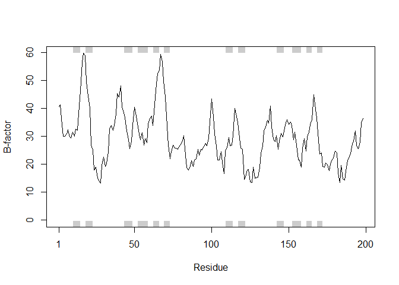

class11
================
Xiao
2019/5/7

## the PDB database

The [PDB](http://www.rcsb.org/) is the main repository for biomolecualr
structral database

Here we examine the content sof the PDB

``` r
db <- read.csv("Data Export Summary.csv")
head(db)
```

    ##   Experimental.Method Proteins Nucleic.Acids Protein.NA.Complex Other
    ## 1               X-Ray   126880          2012               6547     8
    ## 2                 NMR    11062          1279                259     8
    ## 3 Electron Microscopy     2277            31                800     0
    ## 4               Other      256             4                  6    13
    ## 5        Multi Method      129             5                  2     1
    ##    Total
    ## 1 135447
    ## 2  12608
    ## 3   3108
    ## 4    279
    ## 5    137

``` r
# How many are X-Ray
db$Total[1] / sum(db$Total)
```

    ## [1] 0.8935736

``` r
# How many are proteins
sum(db$Proteins) / sum(db$Total)
```

    ## [1] 0.9275955

``` r
library(datapasta)
# Addins -> Paste as dataframe
tmp <- data.frame(stringsAsFactors=FALSE,
          Experimental.Method = c("X-Ray", "NMR", "Electron Microscopy", "Other",
                                  "Multi Method", "Total"),
                     Proteins = c(126880, 11062, 2277, 256, 129, 140604),
                Nucleic.Acids = c(2012, 1279, 31, 4, 5, 3331),
           ProteinComplex = c(6547, 259, 800, 6, 2, 7614),
                        Other = c(8, 8, 0, 13, 1, 30),
                        Total = c(135447, 12608, 3108, 279, 137, 151579)
       )
```

There are 1157 as of 2019-05-07 See:
<http://www.rcsb.org/pdb/results/results.do?tabtoshow=Current&qrid=F0A699D4>

``` r
library(bio3d)
example(plot.bio3d)
```

    ## 
    ## plt.b3> ## No test: 
    ## plt.b3> ##D # PDB server connection required - testing excluded
    ## plt.b3> ##D 
    ## plt.b3> ##D ## Plot of B-factor values along with secondary structure from PDB
    ## plt.b3> ##D pdb <- read.pdb( "1bg2" )
    ## plt.b3> ##D bfac <- pdb$atom[pdb$calpha,"b"]
    ## plt.b3> ##D plot.bio3d(bfac, sse=pdb, ylab="B-factor", col="gray")
    ## plt.b3> ##D points(bfac, typ="l")
    ## plt.b3> ## End(No test)
    ## plt.b3> 
    ## plt.b3> ## Not run: 
    ## plt.b3> ##D ## Use PDB residue numbers and include short secondary structure elements
    ## plt.b3> ##D plot.bio3d(pdb$atom[pdb$calpha,"b"], sse=pdb, resno=pdb, ylab="B-factor",
    ## plt.b3> ##D   typ="l", lwd=1.5, col="blue", sse.min.length=0)
    ## plt.b3> ##D 
    ## plt.b3> ##D 
    ## plt.b3> ##D ## Calculate secondary structure using stride() or dssp()
    ## plt.b3> ##D #sse <- stride(pdb)
    ## plt.b3> ##D sse <- dssp(pdb)
    ## plt.b3> ##D 
    ## plt.b3> ##D ## Plot of B-factor values along with calculated secondary structure
    ## plt.b3> ##D plot.bio3d(pdb$atom[pdb$calpha,"b"], sse=sse, ylab="B-factor", typ="l",
    ## plt.b3> ##D col="blue", lwd=2)
    ## plt.b3> ## End(Not run)
    ## plt.b3> 
    ## plt.b3> ## No test: 
    ## plt.b3> ##D # PDB server connection required - testing excluded
    ## plt.b3> ##D 
    ## plt.b3> ##D ## Plot 'aligned' data respecting gap positions
    ## plt.b3> ##D attach(transducin)
    ## plt.b3> ##D 
    ## plt.b3> ##D pdb = read.pdb("1tnd") ## Reference PDB see: pdbs$id[1]
    ## plt.b3> ##D pdb = trim.pdb(pdb, inds=atom.select(pdb, chain="A"))
    ## plt.b3> ##D 
    ## plt.b3> ##D ## Plot of B-factor values with gaps
    ## plt.b3> ##D plot.bio3d(pdbs$b, resno=pdb, sse=pdb, ylab="B-factor")
    ## plt.b3> ##D 
    ## plt.b3> ##D ## Plot of B-factor values after removing all gaps 
    ## plt.b3> ##D plot.bio3d(pdbs$b, rm.gaps=TRUE, resno = pdb, sse=pdb, ylab="B-factor")
    ## plt.b3> ##D 
    ## plt.b3> ##D detach(transducin)
    ## plt.b3> ## End(No test)
    ## plt.b3> 
    ## plt.b3> ## Fancy secondary structure elements
    ## plt.b3> ##plot.bio3d(pdb$atom[pdb$calpha,"b"], sse=pdb, ssetype="fancy")
    ## plt.b3> ## Currently not implemented
    ## plt.b3> 
    ## plt.b3> 
    ## plt.b3>

``` r
pdb <- read.pdb("1hsg")
```

    ##   Note: Accessing on-line PDB file

``` r
pdb
```

    ## 
    ##  Call:  read.pdb(file = "1hsg")
    ## 
    ##    Total Models#: 1
    ##      Total Atoms#: 1686,  XYZs#: 5058  Chains#: 2  (values: A B)
    ## 
    ##      Protein Atoms#: 1514  (residues/Calpha atoms#: 198)
    ##      Nucleic acid Atoms#: 0  (residues/phosphate atoms#: 0)
    ## 
    ##      Non-protein/nucleic Atoms#: 172  (residues: 128)
    ##      Non-protein/nucleic resid values: [ HOH (127), MK1 (1) ]
    ## 
    ##    Protein sequence:
    ##       PQITLWQRPLVTIKIGGQLKEALLDTGADDTVLEEMSLPGRWKPKMIGGIGGFIKVRQYD
    ##       QILIEICGHKAIGTVLVGPTPVNIIGRNLLTQIGCTLNFPQITLWQRPLVTIKIGGQLKE
    ##       ALLDTGADDTVLEEMSLPGRWKPKMIGGIGGFIKVRQYDQILIEICGHKAIGTVLVGPTP
    ##       VNIIGRNLLTQIGCTLNF
    ## 
    ## + attr: atom, xyz, seqres, helix, sheet,
    ##         calpha, remark, call

``` r
attributes(pdb)
```

    ## $names
    ## [1] "atom"   "xyz"    "seqres" "helix"  "sheet"  "calpha" "remark" "call"  
    ## 
    ## $class
    ## [1] "pdb" "sse"

``` r
head(pdb$atom)
```

    ##   type eleno elety  alt resid chain resno insert      x      y     z o
    ## 1 ATOM     1     N <NA>   PRO     A     1   <NA> 29.361 39.686 5.862 1
    ## 2 ATOM     2    CA <NA>   PRO     A     1   <NA> 30.307 38.663 5.319 1
    ## 3 ATOM     3     C <NA>   PRO     A     1   <NA> 29.760 38.071 4.022 1
    ## 4 ATOM     4     O <NA>   PRO     A     1   <NA> 28.600 38.302 3.676 1
    ## 5 ATOM     5    CB <NA>   PRO     A     1   <NA> 30.508 37.541 6.342 1
    ## 6 ATOM     6    CG <NA>   PRO     A     1   <NA> 29.296 37.591 7.162 1
    ##       b segid elesy charge
    ## 1 38.10  <NA>     N   <NA>
    ## 2 40.62  <NA>     C   <NA>
    ## 3 42.64  <NA>     C   <NA>
    ## 4 43.40  <NA>     O   <NA>
    ## 5 37.87  <NA>     C   <NA>
    ## 6 38.40  <NA>     C   <NA>

``` r
pdb$atom[1:2, c("eleno", "elety", "x","y","z")]
```

    ##   eleno elety      x      y     z
    ## 1     1     N 29.361 39.686 5.862
    ## 2     2    CA 30.307 38.663 5.319

``` r
pdb$atom$elety[1:2]
```

    ## [1] "N"  "CA"

``` r
plot.bio3d(pdb$atom$b[pdb$calpha], sse=pdb, typ="l", ylab="B-factor")
```

<!-- -->

Atom selection is done via the function atom.select

``` r
lig.pdb <- atom.select(pdb, "ligand", value = T)
write.pdb(lig.pdb, file = "1hsg_ligand.pdb")
```

``` r
prot.pdb <- atom.select(pdb, "protein", value = T)
write.pdb(prot.pdb, file = "1hsg_protein.pdb")
```
