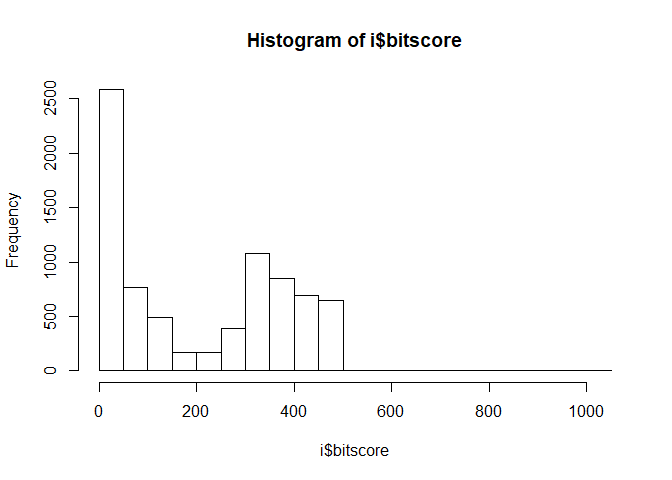
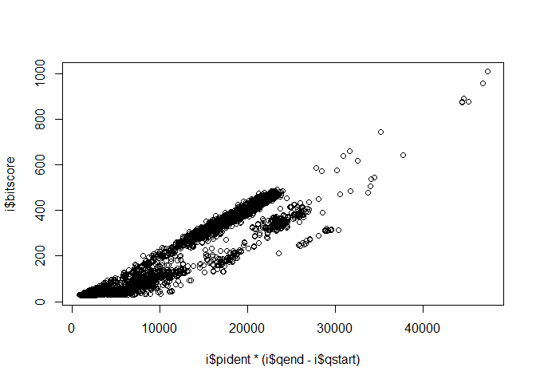
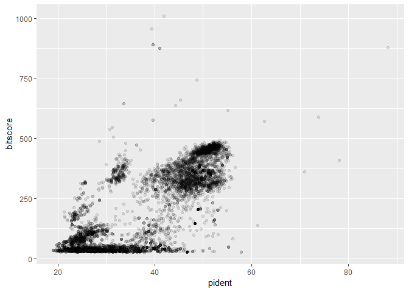
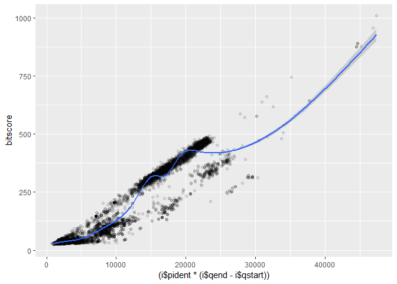

class16
================
Xiaoyan Ren
5/23/2019

``` r
i <- read.delim("mm-second.x.zebrafish.tsv")
name <- c("qseqid", "sseqid", "pident", "length", "mismatch", "gapopen", "qstart", "qend", "sstart", "send", "evalue", "bitscore")
names(i) <- name
```

``` r
hist(i$bitscore, breaks =30)
```

<!-- -->

``` r
plot(i$pident  * (i$qend - i$qstart), i$bitscore)
library(ggplot2)
```

<!-- -->

``` r
ggplot(i, aes(pident, bitscore)) + geom_point(alpha=0.1) 
```

<!-- -->

``` r
ggplot(i, aes((i$pident * (i$qend - i$qstart)), bitscore)) + geom_point(alpha=0.1) + geom_smooth()
```

    ## `geom_smooth()` using method = 'gam' and formula 'y ~ s(x, bs = "cs")'

<!-- -->
